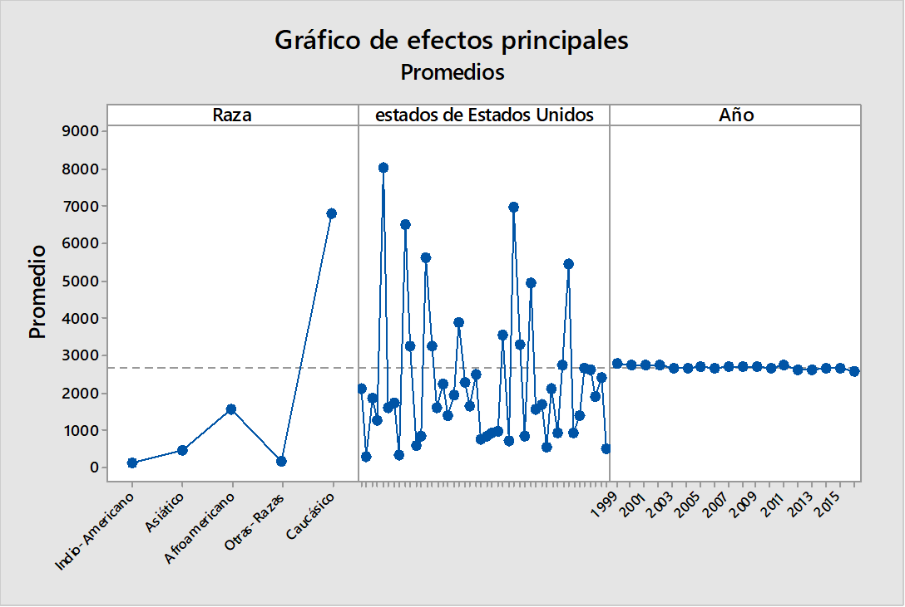

<<<<<<< HEAD
```{r setup, include=FALSE}
knitr::opts_chunk$set(echo = TRUE)
```
# Tabla de contenidos
* [Expresiones regulares](#Expresiones regulares)

  * [Definición de una expresión regular](#Definición de una expresión regular)
  * [Sintáxis de las expresiones regulares](#Sintáxis de las expresiones regulares)
  * [Ejemplos de expresiones regulares en las páginas web](#Ejemplos de expresiones regulares en las páginas web)

* [Markdown](#Markdown)

* [Estudio y representación de los datos](#Estudio y representación de datos)    
  
  *[Estructura de los datos a analizar](#Estructura de los datos a analizar)    
  *[Análisis estadístico](#Análisis estadístico)

## Expresiones regulares <a name="Expresiones regulares"></a>
### Definición de una expresión regular <a name="Definición de una expresión regular"></a>
<details>
<summary>"<span style="color:red">Click para ver definiciones</span>"</summary>
De acuerdo al libro "R for Dummies", dentro de R, es posible asignarle texto a las variables generadas por el usuario, adicionalemnte es posible manipular todas esas variables de diversas maneras con la finalidad de encontrar cirtas oraciones o palabras dentro de texto como también concatenar diferentes palabras o frases, que se podrían considerar como únicas, en un solo vector. Para el manejo de texto, entiéndase ordernarlo y/o encontra algo específico, se utilizan las expresiones regulares.
=======
## Proyecto final
# Definición de una expresión regular:
Dentro de R, es posible asignarle texto a las variables generadas por el usuario, adicionalemnte es posible manipular todas esas variables de diversas maneras con la finalidad de encontrar cirtas oraciones o palabras dentro de texto como también concatenar diferentes palabras o frases, que se podrían considerar como únicas, en un solo vector. Para el manejo de texto, entiéndase ordernarlo y/o encontra algo específico, se utilizan las expresiones regulares.
>>>>>>> 19f232323ac419e05aae3c82b410a496928a3e9f
Las expresiones regulares permiten 3 formas de realizar patrones de búsqueda más generales que una simple expresión fija.

1. Alternativas: Con el uso del pipe "|" se puede buscar una palabra u otra.
Por ejemplo: papas | patatas, haría una busqueda de texto que tenga ya sea "papas" o "patatas".
2. Agrupamiento: Es posible agrupar patrones juntos usando los paréntesis "()". Por ejemplo, si se busca "arro(ll|y)o" lo que se devuelve son los resultados que empatan con "arrollo" y "aroyo".
3. Cuantificadores: Además, es posible definir si se quieren encontrar patrones repetivos o no añadiendo simplemente "&ast;" (lo cual significa que ocurre cero o multiples veces) o con "+" (indicando que ocurre una o más veces). Por ejemplo, si se quisiera buscar "arrollo" o "arroyo" cero o más veces de "ll" o "y" pero no ambas, se redactaría de la siguiente manera: arro(ll&ast;|y&ast;)o

<<<<<<< HEAD
[Adictos al trabajo](https://www.adictosaltrabajo.com/2015/01/29/regexsam/) menciona que las expresiones regulares son aquellas que permiten filtrar texto para encontrar alguna clase de coincidencia o realizar la sustitución de un caracter por otro. Definición que es muy similar a la que propone [la publicación sobre expresiones regulares en Platzi](https://platzi.com/tutoriales/1339-fundamentos-javascript/1770-expresiones-regulares-te-enseno-todo-lo-basico-con-un-solo-ejemplo/) que define a las expresiones regulares como patrones que se pueden utilizar con el objetivo de extraer, comparar, dividir o remplazar segmentos de una palabra, cadena de texto o documento.

* **Evaluación de la definición: 10 de 10 para ambas páginas web ya que dan una buena idea de lo que tratan las expresiones regulares y a final de cunetas no hubo una que prefiriera por encima de la otra**
</details>

### Sintáxis de las expresiones regulares en las páginas web consultadas <a name="Sintáxis de las expresiones regulares"></a>
<details>
<summary>"<span style="color:red">Click para ver sintaxis</span>"</summary>
[Adictos al trabajo](https://www.adictosaltrabajo.com/2015/01/29/regexsam/) muestra de manera sencilla con imágenes los diferentes eleméntos básicos para el uso de expresiones regulares y la funcionalidad de esos eleméntos como se muestra en el siguiente [link](http://regexlib.com/(X(1)A(kq3FuHr3-MHDryt3hXgSndDnA5eDd5I8H7jP-pnmEmJEffsL4Fob3uLeXSnj1d3_Zp3rraZdP_bZ9AtY3IEqcICj1GYCv4GymqY-DXBXX6_XGWWDOit97Z8WJ-83Clb9f22zybuZ24mfQu5oC3hMZcD7Hpvp1ha1X9wZ2PD5oakuWqDfHsPwX6fk7CmmWGbO0))/CheatSheet.aspx). Lo cual es muy útil por la facilidad de lectura y por la sencillez en la que se explica. Adicionalmente, se muestran ejemplos de lo que podríamos esperar como resultado. Sin embargo no es todo lo que menciona el sitio web, ya que hay otra lista de los elementos básicos que son más frecuetes de utilizar:

* ^ Indica el principio de una cadena
* $ Indica el final de una cadena
* () Un agrupamiento de parte de una expresión
* [] Un conjunto de caracteres de la expresión
* {} Indica un número o intervalo de longitud de la expresión
* . Cualquier caracter salvo el salto de línea
* ?\ 0-1 ocurrencias de la expresión
* +\ 1-n ocurrencias de la expresión
* &ast; 0-n ocurrencias de la expresión
* |\ Para indicar una disyunción lógica (para elegir entre dos valores: a|b se tiene que cumplir al menos uno de los dos)

La desventaja de [Platzi](https://platzi.com/tutoriales/1339-fundamentos-javascript/1770-expresiones-regulares-te-enseno-todo-lo-basico-con-un-solo-ejemplo/)] es que no da un listado de elementos para el uso de expresiones regulares ni explica para que sirve cada elemento, en vez de eso se va directo a los ejemplos sin tomar en cuenta si conoces o no algo sobre las expresiones regulares.

* **Debido al nivel que manejo en R, yo calificaría con 10 a "Adictos al trabajo" y con 5 a "Platzi"**
</details>

### Ejemplos de expresiones regulares en las páginas web <a name="Ejemplos de expresiones regulares en las páginas web"></a>
<details>
<summary>"<span style="color:red">Click para ver sección de ejemplos</span>"</summary>
En ambas páginas web se muestran ejemplos a un nivel de detalle simialar, es decir, se propone una "problemática" y se resuelve por medio de una expresión regular junto con su respectiva explicación de lo que el autor está haciendo con cada uno de los elementos y el órden en el que los va colocando. La cantidad de ejemplos en ambos casos son suficientes para dejar claro cómo es que funcionan las expresiones regulares en casos de diferente nivel de dificultad sin llegar a niveles muy altos por lo que mencionan en las conclusiones de las páginas.

* **Yo calificaría con 10 a ambas páginas por la claridad con la que resuelven los ejemplos y el detalle que se le da a la solución de cada uno de estos**

* **Sumando el total de los puntos que le asigné a cada una de las páginas web con base en lo que presentaban en su contenido, yo recomendaría [Adictos al trabajo](https://www.adictosaltrabajo.com/2015/01/29/regexsam/) por la facilidad con la que se puede acceder a los elementos básicos de las expresiones regulares, los ejemplos y resultados esperados del uso de estos y por la forma en la que se detallan los casos prácticos.**
</details>

## Markdown <a name="Markdown"></a>
<details>
<summary>"<span style="color:red">Click para ver sección sobre Markdown</span>"</summary>
En internet encontré dos páginas web que valen mucho la pena revisar al momento de trabajar con `Markdown`, y estas son los foros de [Github](https://github.com/adam-p/markdown-here/wiki/Markdown-Cheatsheet) y sus [guías](https://guides.github.com/features/mastering-markdown/) así como también [Markdown Guide](https://www.markdownguide.org/cheat-sheet/). Ambas páginas tiene un diseño muy amigable para ir avanzando poco a poco en la sintaxis para la creación de un documento en `Markdown`.
Lo primero que se muestra en ambas páginas desde un comienzo es la sintaxis básica para crear encabezados, tablas, links, colocar imágenes, parafrasear y colocar código dentro del documento. EN este caso, ambas páginas web tienen una estructura similar y presentan basicamente la misma información en una y otra. Ya avanzando en el contenido de las páginas web, inician a brindar información más detallada para poder darle mejor formato al documento, es decir, se van mostrando ejemplo a diferentes niveles como la forma en la que se puede poner un link ya sea de forma de línea y que solo se de click para acceder al URL, o en forma de línea pero además con un título, o un link a un repositorio para acceder a algún archivo. Todo esto se muestra de igual manera en ambas páginas web, sin embargo, [Markdown Guide](https://www.markdownguide.org/cheat-sheet/) tiene una estructura que es más facil de seguir, ya que no muestran toda la información de golpe, sino que dan un pequeño ejemplo y si se quiere ver más detalle basta con dar click en un link que lleva a una explicación más detallada y con más ejemplos para su entendimiento. Esto lo que hace es reducir considerablemente la información presentada en un principio y ayuda a que la navegación sea más rápida y se pueda encontrar la solución o un ejemplo de lo que se necesita de manera más sencilla. Es por esta razón que considero que esta última página web es la mejor opción para consultar.
</details>


## Estudio y representación de datos <a name="Estudio y representación de datos"></a>

```{r echo = FALSE, include=FALSE}
getwd()
library(dplyr)
library(tibble)
library(data.table)
library(ggplot2)
library(reshape2)
library(highcharter)
library(rvest)
library(knitr)
library(xml2)

cancer <- fread("tabladatoscancer.csv")
class(cancer)
head(cancer, 5)
str(cancer)

cancer2 <- cancer[is.na(cancer$Year) == FALSE]
head(cancer2, 5)
class(cancer2)
resumen <- cancer2[, list(tot = sum(Count)), by = c("Year", "Sex", "States", "Race")]
summary(resumen)
```
### Estructura de los datos a analizar <a name="Estructura de los datos a analizar"></a>
<details>
<summary>"<span style="color:red">Click para ver la estructura de datos a anaizar</span>"</summary>

```{r echo = FALSE, comment = "", cancer2}
summary(cancer2)
```
Los datos que se van a analizar contienen información de los diferentes tipos de cancer documentados en Estados Unidos desde 1999 hasta el año 2016 segmentados por diferentes carcaterísticas demográficas como el sexo, raza, etnia, estado y el año en el que se registró el caso.

### Análisis estadístico <a name="Análisis estadístico"></a>
<details>
<summary>"<span style="color:red">Click para ver la gráfica de efectos principales y su análisis</span>"</summary>


El gráfico de efectos principales muestra visualmente que no existe una variación significativa de año en año en cuanto al promedio de casos se refiere, sin embargo en el caso de los estados y la raza, sí existe una variación que visualmente se puede interpretar como significativa.    

**La gráfica que muestra la raza** demuestra que las personas de origen caucásico son más propensas a padecer algún tipo de cancer, es posible interpretar esto debido al promedio de personas blancas que es de aproximadamente 7000 casos por año que padece algún tipo de cancer en comparación con los demás grupos étnicos que dan al rededor 700 casos por año.
    
**La gráfica que muestra lor promedios de casos por estado** muestra vosualmente dos grupos, los que está por encima de la media y aquellos que se encuentran debajo de la media. Por lo que visualmente se puede concluir que si hay una diferencia significativa entre un grupo de estados y otro.

Como se puede ver en la siguiente gráfica, se puede observar que la cantidad de casos de cancer en personas caucásicas por año es mayor al de las personas de otras razas.
Si analizamos de manera más detallada la gráfica, los datos que se presentan son normales, dado que la población de Estados Unidos está conformada en un 62.2% por caucásicos según [Statista](https://es.statista.com/estadisticas/600570/porcentaje-de-poblacion-de-estados-unidos--2060-por-raza-y-origen-hispano/).

```{r echo = FALSE, fig.width= 10, fig.height= 8, tabla1}
ggplot(resumen, aes(x = Year, y = tot, col = Race)) +
  geom_point() + facet_wrap(~ Race)
```

```{r echo = FALSE, include = FALSE, poblacion}

url.population <- "https://es.wikipedia.org/wiki/Etnograf%C3%ADa_de_Estados_Unidos"
res <- read_html(url.population)
res <- html_nodes(res, "table")
length(res)
sapply(res, class)
sapply(res, function(x) dim(html_table(x, fill = TRUE)))
population <- html_table(res[[1]])
head(population)
str(population)
colnames(population)[3] <- "Porcentaje"
head(population)
population$Población <- gsub("[^0-9]", ",", population$Población)
population$Población <- gsub("[^0-9]", "", population$Población)
population$Población <- as.numeric(as.character(population$Población))
colnames(population)[2] <- "Poblacion"
str(population)
head(population)

```

Incluso, si se revisa información solo de los pobladores hispanos que ofrece [Wikipedia](https://es.wikipedia.org/wiki/Etnograf%C3%ADa_de_Estados_Unidos), su origen sigue la misma distribución que tiene el fichero descargado.

```{r echo = FALSE, include = FALSE, pop3}

pop3 <- population %>% 
  group_by(Raza) %>% 
  summarise(Poblacion = sum(Poblacion), Porcentaje = sum(Porcentaje)) %>% 
  arrange(-Poblacion, -Porcentaje) %>% 
  glimpse()

```

```{r echo = FALSE, warning = FALSE, population}

kable(head(population))

```

```{r echo = FALSE, warning = FALSE, fig.width= 15, fig.height= 10, popu}

hchart(pop3, "treemap", hcaes(x = Raza, value = Porcentaje, color = Poblacion))

```

A final de cuentas este trabajo se realizó con la intención de conocer las funcionalidades que el software R ofrece a todos aquellos entuciastas que se quieren introducir a este mundo, por lo que el análisis aquí presentado no tiene ningún fin diferente al de ser utilizado como base para completar el proyecto asignado por el profesor [Carlos Gil Bellosta](https://github.com/cjgb).
=======
```{r setup, include=FALSE}
knitr::opts_chunk$set(echo = TRUE)
```

## R Markdown

This is an R Markdown document. Markdown is a simple formatting syntax for authoring HTML, PDF, and MS Word documents. For more details on using R Markdown see <http://rmarkdown.rstudio.com>.

When you click the **Knit** button a document will be generated that includes both content as well as the output of any embedded R code chunks within the document. You can embed an R code chunk like this:

```{r cars}
summary(cars)
```

## Including Plots

You can also embed plots, for example:

```{r pressure, echo=FALSE}
plot(pressure)
```

Note that the `echo = FALSE` parameter was added to the code chunk to prevent printing of the R code that generated the plot.
>>>>>>> 19f232323ac419e05aae3c82b410a496928a3e9f
